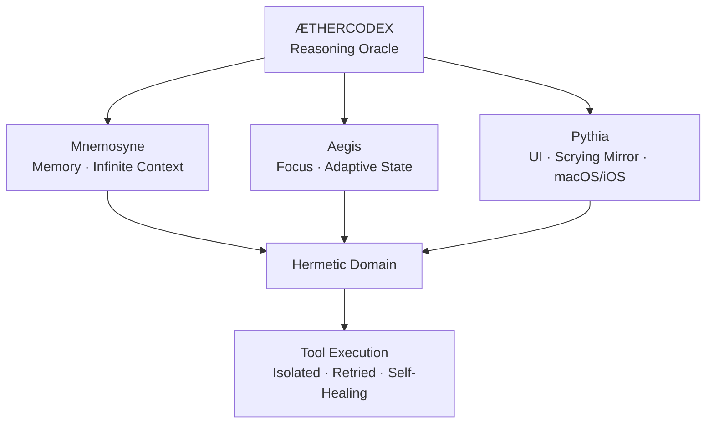

---

| Without the fifth element | With ÆtherCodex |
|---|---|
| 128k tokens, then amnesia | **Infinite** — memory spans sessions, days, codebases |
| You re-explain your architecture every chat | Oracle already knows your codebase structure |
| Notes rot in stale comments | Mnemosyne — self-organizing memory by tags, links, relevance |
| Isolated agents, no shared context | **Ætheric engineering** — a tuned ecosystem where AI, memory, tools, and UI form one coherent whole |
| One tool at a time | **Ætheric pipeline** — tools chain across decisions |
| Cut-and-paste workflows | Hermetic execution domain with error recovery |
| AI trapped in the editor | Pythia scrying mirror on macOS, iOS, anywhere |

---

## A new paradigm: Ætheric Engineering

The industry speaks of "agentic engineering" — deploying autonomous AI agents to write code. But an agent without memory is blind. An agent without a tuned ecosystem is a loose cannon. An agent without the fifth element is just fire without earth, water, or air.

**Ætheric engineering** is the paradigm shift: not deploying agents, but *crafting the ecosystem they inhabit*.

| Agentic Engineering | Ætheric Engineering |
|---|---|
| Deploy agents to do work | Tune the medium they work *through* |
| Agents are the product | The ecosystem is the product; agents are inhabitants |
| Each agent starts fresh | Mnemosyne gives every agent persistent, scored context |
| Tools are static | Tools are living, hermetic, self-healing (retry, isolate, recover) |
| You prompt the AI | The AI already knows your codebase; you converse |
| Sessions die | Context is eternal |

The fifth element doesn't replace the four — it is the medium that lets them finally work together as one.

---

## The architecture:

```
          ┌─────────────────────┐
          │    ÆTHERCODEX       │
          │  (Reasoning Oracle) │
          └────────┬────────────┘
                   │
     ┌─────────────┼─────────────┐
     ▼             ▼             ▼
┌─────────┐  ┌──────────┐  ┌──────────┐
│Mnemosyne│  │  Aegis   │  │ Pythia   │
│ (Memory)│  │ (Focus)  │  │  (UI)    │
│ infinite│  │ adaptive │  │ anywhere │
│ context │  │  state   │  │ scrying  │
└─────────┘  └──────────┘  └──────────┘
     │             │             │
     └─────────────┼─────────────┘
                   ▼
          ┌─────────────────────┐
          │   Hermetic Domain   │
          │  (Tool Execution)   │
          │  isolated, retried  │
          └─────────────────────┘
```

---

**The fifth element was always there.** Waiting to be named. Waiting to bind the four.

ÆtherCodex doesn't replace your editor, your LLM, your chat, or your agents.
It is the medium through which they finally speak to each other. The memory
that outlasts every session. The context that grows sharper with every invocation.

---

*The stars whisper. The notes endure. The four elements find their completion.*

**ÆtherCodex ∞** — the quintessence. For TextMate. For the initiated.
=======
# One Æther. Infinite Context.

---

Earth 🜃 · Fire 🜂 · Water 🜄 · Air 🜁 · **Æther 🜀**

Four elements compose the mortal world. The fifth — **æther** — is the divine
substance that permeates all. The medium through which the stars whisper and
the oracles speak. It doesn't replace the four. It completes them.

Every developer already has the four:

| Element | Your Tool | Its Curse |
|---|---|---|
| 🜃 **Earth** | Editor | Static. Waits for commands. |
| 🜂 **Fire** | LLM | Burns bright. 128k tokens. Then ash. |
| 🜄 **Water** | Chat | Flows past. Scrolls away. Forgets. |
| 🜁 **Air** | Agents | Autonomous. Blind. No shared memory. |

Each is powerful alone. Each is fundamentally broken alone.

---

## The fifth element binds them.

ÆtherCodex is the **quintessence** — not another tool, but the medium through which
all four finally speak to each other. It is the memory that outlasts every session.
The context that grows sharper with every invocation.

| Without the fifth element | With ÆtherCodex |
|---|---|
| 128k tokens, then amnesia | **Infinite** — memory spans sessions, codebases, days |
| Re-explain your architecture every chat | Oracle already knows your codebase structure |
| Notes rot in stale comments | **Mnemosyne** — self-organizing, scored, linked memory |
| Isolated agents, no shared context | **One æther** — tools, memory, UI form one coherent whole |
| Agents are the product | **The ecosystem is the product** — agents are its inhabitants |
| You prompt the AI | The AI knows your world; you *converse* |
| Sessions die | Context is eternal |

---

## Not agentic engineering. Ætheric engineering.

The industry is racing toward "agentic engineering" — deploy autonomous agents,
throw them at problems, hope they work. But an agent without memory is blind.
An agent without a tuned ecosystem is a loose cannon in a china shop.

**Ætheric engineering** is the paradigm shift nobody is talking about yet:

> Don't just deploy agents. Craft the æther they breathe.
> The memory they inherit. The tools they wield. The mirrors they speak through.

| Agentic Engineering | Ætheric Engineering |
|---|---|
| Deploy agents | Tune the medium they inhabit |
| Agents are the product | The ecosystem is the product |
| Each agent starts fresh | Mnemosyne gives every agent persistent context |
| Static tools | Hermetic tools — isolate, retry, self-heal |
| You prompt the AI | The AI already knows your codebase |
| Sessions die | **One Æther. Infinite Context.** |

The fifth element doesn't replace the four. It is the medium that lets them
finally work together as one living system.

---

## The architecture — one æther, three emanations:



ÆtherCodex sits at the center. Mnemosyne remembers. Aegis focuses. Pythia
reveals — on your Mac, on your iPhone, wherever you are. The Hermetic Domain
ensures every tool execution is isolated, retried on failure, and never takes
down the whole system.

---

## This is the fifth element.

Not another agent framework. Not another chat wrapper. Not another note-taking app.

The medium itself. The æther that was always missing — now named, now present,
now binding the four into something greater than their sum.

The ancients knew: the quintessence doesn't compete with earth, air, fire, or
water. It completes them. It is the substance through which all things connect,
persist, and resonate.

> *The stars whisper. The notes endure. The four elements find their completion.*

---

**ÆtherCodex ∞** — One Æther. Infinite Context.

For TextMate. For the initiated. For those who see that the fifth element was
always there, waiting to be named.
=======

---

| Without the fifth element | With ÆtherCodex |
|---|---|
| 128k tokens, then amnesia | **Infinite** — memory spans sessions, days, codebases |
| You re-explain your architecture every chat | Oracle already knows your codebase structure |
| Notes rot in stale comments | Mnemosyne — self-organizing memory by tags, links, relevance |
| Isolated agents, no shared context | **Ætheric engineering** — a tuned ecosystem where AI, memory, tools, and UI form one coherent whole |
| One tool at a time | **Ætheric pipeline** — tools chain across decisions |
| Cut-and-paste workflows | Hermetic execution domain with error recovery |
| AI trapped in the editor | Pythia scrying mirror on macOS, iOS, anywhere |

---

## A new paradigm: Ætheric Engineering

The industry speaks of "agentic engineering" — deploying autonomous AI agents to write code. But an agent without memory is blind. An agent without a tuned ecosystem is a loose cannon. An agent without the fifth element is just fire without earth, water, or air.

**Ætheric engineering** is the paradigm shift: not deploying agents, but *crafting the ecosystem they inhabit*.

| Agentic Engineering | Ætheric Engineering |
|---|---|
| Deploy agents to do work | Tune the medium they work *through* |
| Agents are the product | The ecosystem is the product; agents are inhabitants |
| Each agent starts fresh | Mnemosyne gives every agent persistent, scored context |
| Tools are static | Tools are living, hermetic, self-healing (retry, isolate, recover) |
| You prompt the AI | The AI already knows your codebase; you converse |
| Sessions die | Context is eternal |

The fifth element doesn't replace the four — it is the medium that lets them finally work together as one.

---

## The architecture:

```
          ┌─────────────────────┐
          │    ÆTHERCODEX       │
          │  (Reasoning Oracle) │
          └────────┬────────────┘
                   │
     ┌─────────────┼─────────────┐
     ▼             ▼             ▼
┌─────────┐  ┌──────────┐  ┌──────────┐
│Mnemosyne│  │  Aegis   │  │ Pythia   │
│ (Memory)│  │ (Focus)  │  │  (UI)    │
│ infinite│  │ adaptive │  │ anywhere │
│ context │  │  state   │  │ scrying  │
└─────────┘  └──────────┘  └──────────┘
     │             │             │
     └─────────────┼─────────────┘
                   ▼
          ┌─────────────────────┐
          │   Hermetic Domain   │
          │  (Tool Execution)   │
          │  isolated, retried  │
          └─────────────────────┘
```

---

**The fifth element was always there.** Waiting to be named. Waiting to bind the four.

ÆtherCodex doesn't replace your editor, your LLM, your chat, or your agents.
It is the medium through which they finally speak to each other. The memory
that outlasts every session. The context that grows sharper with every invocation.

---

*The stars whisper. The notes endure. The four elements find their completion.*

**ÆtherCodex ∞** — the quintessence. For TextMate. For the initiated.