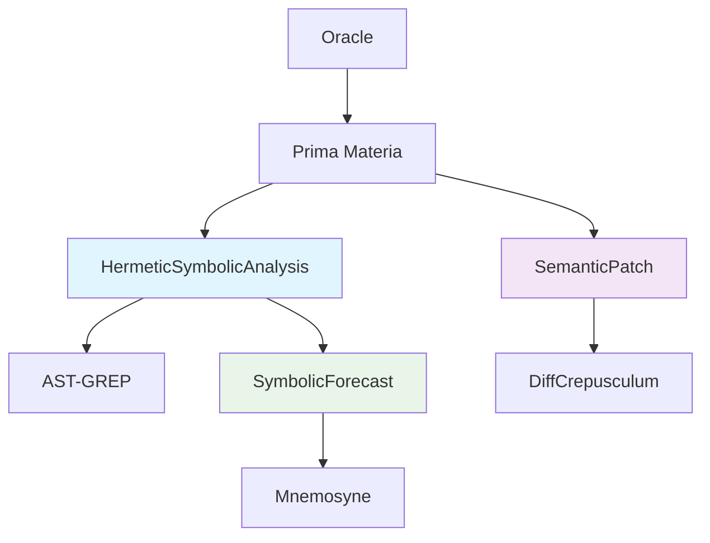

# 🔗 Integration Guide: Hermetic Symbolic Analysis Engine

## 📋 Overview

This guide explains how to integrate the Hermetic Symbolic Analysis Engine with existing AetherCodex components and workflows. The engine provides AST-GREP powered semantic analysis that can enhance various parts of the system.

## 🏗️ Architecture Integration

### Component Relationships



### Integration Points

1. **Prima Materia Integration**: The main execution engine can route appropriate operations to semantic analysis
2. **DiffCrepusculum Enhancement**: Hybrid patching combines AST-based and line-based approaches
3. **Mnemosyne Integration**: Symbolic forecasts and patterns can be stored in memory
4. **Argonaut Enhancement**: File overview can include symbolic analysis results

## 🔧 Integration Examples

### 1. Enhancing Prima Materia Tool Execution

**Modify `Prima Materia` to use semantic analysis when appropriate:**

```ruby
# In Support/instrumentarium/prima_materia.rb

def execute_tool(tool_name, args)
  case tool_name
  when :patch_file
    # Check if patch can be handled semantically
    if semantic_patch_available?(args)
      execute_semantic_patch(args)
    else
      execute_line_based_patch(args)
    end
  when :analyze_code
    execute_symbolic_analysis(args)
  else
    super
  end
end

def semantic_patch_available?(args)
  file_path = args[:path]
  patch_text = args[:diff]
  
  analysis = SemanticPatch.analyze_patch_strategy(patch_text, file_path)
  analysis[:can_be_semantic]
end

def execute_semantic_patch(args)
  file_path = args[:path]
  patch_text = args[:diff]
  
  SemanticPatch.apply_hybrid_patch(file_path, patch_text)
end
```

### 2. Enhancing Argonaut File Overview

**Add symbolic analysis to file overview:**

```ruby
# In Support/argonaut/argonaut.rb

def file_overview(path, options = {})
  # Existing symbolic parsing
  overview = super
  
  # Add hermetic symbolic analysis if requested
  if options[:include_symbolic_analysis]
    overview[:hermetic_symbols] = HermeticSymbolicAnalysis.extract_hermetic_symbols(path)
    overview[:transformation_forecasts] = SymbolicForecast.forecast_file_transformations(path)
  end
  
  overview
end
```

### 3. Memory Integration with Mnemosyne

**Store symbolic patterns in memory:**

```ruby
# In Support/mnemosyne/mnemosyne.rb

def remember_symbolic_patterns(file_path)
  symbols = HermeticSymbolicAnalysis.extract_hermetic_symbols(file_path)
  forecasts = SymbolicForecast.forecast_file_transformations(file_path)
  
  # Store in memory with appropriate tags
  remember(
    content: "Hermetic symbols for #{file_path}: #{symbols.inspect}",
    tags: ['symbolic-analysis', 'hermetic', File.basename(file_path)],
    links: [file_path]
  )
  
  remember(
    content: "Transformation forecasts for #{file_path}: #{forecasts.inspect}",
    tags: ['forecast', 'refactoring', File.basename(file_path)],
    links: [file_path]
  )
end
```

## 🚀 Usage Patterns

### 1. Intelligent Patching System

**Create a smart patching system that chooses the best approach:**

```ruby
module SmartPatching
  def self.apply_intelligent_patch(file_path, patch_text)
    # Analyze patch to determine best strategy
    analysis = SemanticPatch.analyze_patch_strategy(patch_text, file_path)
    
    case analysis[:recommended_approach]
    when :semantic
      # Use semantic patching for AST-based transformations
      apply_semantic_patch(file_path, patch_text)
    when :line_based
      # Use traditional line-based patching for complex changes
      apply_line_based_patch(file_path, patch_text)
    else
      # Hybrid approach: try semantic first, fallback to line-based
      apply_hybrid_patch(file_path, patch_text)
    end
  end
  
  def self.apply_semantic_patch(file_path, patch_text)
    semantic_patch = HermeticSymbolicAnalysis.convert_to_semantic_patch(patch_text)
    
    SemanticPatch.apply_semantic_patch(
      file_path,
      semantic_patch[:search],
      semantic_patch[:replace],
      lang: HermeticSymbolicAnalysis.detect_language(file_path)
    )
  end
end
```

### 2. Automated Refactoring Assistant

**Create an AI-powered refactoring assistant:**

```ruby
class RefactoringAssistant
  def initialize(file_path)
    @file_path = file_path
    @symbols = HermeticSymbolicAnalysis.extract_hermetic_symbols(file_path)
    @forecasts = SymbolicForecast.forecast_file_transformations(file_path)
  end
  
  def suggest_refactorings
    # Generate refactoring suggestions based on symbolic patterns
    suggestions = []
    
    # Suggest method refactoring based on fire patterns
    if @symbols[:fire] && @symbols[:fire].size > 5
      suggestions << {
        type: :method_extraction,
        description: "Extract common method patterns into modules",
        confidence: 0.8,
        pattern: @symbols[:fire].first(3).map { |m| m[:match] }
      }
    end
    
    # Suggest class reorganization based on earth patterns
    if @symbols[:earth] && @symbols[:earth].size > 2
      suggestions << {
        type: :class_reorganization,
        description: "Reorganize classes for better single responsibility",
        confidence: 0.7,
        pattern: @symbols[:earth].map { |c| c[:match] }
      }
    end
    
    suggestions
  end
  
  def apply_refactoring(refactoring_type)
    # Apply specific refactoring patterns
    case refactoring_type
    when :method_extraction
      extract_common_methods
    when :class_reorganization
      reorganize_classes
    end
  end
end
```

### 3. Real-time Code Analysis

**Integrate with real-time editing sessions:**

```ruby
class RealTimeAnalysis
  def initialize(editor_session)
    @session = editor_session
    @file_path = editor_session.file_path
  end
  
  def analyze_current_state
    # Extract symbols from current editor content
    content = @session.get_content
    temp_file = create_temp_file(content)
    
    begin
      symbols = HermeticSymbolicAnalysis.extract_hermetic_symbols(temp_file)
      forecasts = SymbolicForecast.forecast_file_transformations(temp_file)
      
      {
        symbols: symbols,
        forecasts: forecasts,
        suggestions: generate_suggestions(symbols, forecasts)
      }
    ensure
      File.delete(temp_file)
    end
  end
  
  def generate_suggestions(symbols, forecasts)
    # Generate real-time suggestions based on current code state
    suggestions = []
    
    # Add suggestions based on hermetic patterns
    suggestions += suggest_based_on_elemental(symbols)
    suggestions += suggest_based_on_alchemical(symbols)
    suggestions += suggest_based_on_forecasts(forecasts)
    
    suggestions.sort_by { |s| -s[:priority] }
  end
end
```

## 🔧 Configuration

### Environment Setup

**Add to configuration system:**

```ruby
# In configuration setup
AetherCodex.configure do |config|
  # Hermetic Symbolic Analysis settings
  config.hermetic_symbolic_analysis.enabled = true
  config.hermetic_symbolic_analysis.ast_grep_path = `which ast-grep`.chomp
  config.hermetic_symbolic_analysis.default_languages = ['ruby', 'javascript', 'python']
  config.hermetic_symbolic_analysis.cache_symbols = true
  config.hermetic_symbolic_analysis.auto_forecast = false
end
```

### Error Handling Integration

**Integrate with HermeticExecutionDomain:**

```ruby
# All external operations should use HermeticExecutionDomain
HermeticExecutionDomain.execute do
  HermeticSymbolicAnalysis.ast_grep_execute(...)
end

# Custom error handling for AST-GREP specific errors
rescue HermeticExecutionDomain::Error => e
  if e.message.include?('ast-grep')
    handle_ast_grep_error(e)
  else
    raise e
  end
end

def handle_ast_grep_error(error)
  case error.message
  when /command not found/
    # AST-GREP not installed
    suggest_ast_grep_installation
  when /pattern syntax error/
    # Invalid pattern
    suggest_pattern_correction
  when /file not found/
    # File access issue
    handle_file_access_error
  end
end
```

## 🧪 Testing Integration

### Unit Tests

**Add tests for integration points:**

```ruby
# test_hermetic_integration.rb
require 'test_helper'
require_relative '../instrumentarium/hermetic_symbolic_analysis'
require_relative '../instrumentarium/prima_materia'

class HermeticIntegrationTest < Minitest::Test
  def test_semantic_patch_integration
    # Test that Prima Materia can use semantic patching
    patch_text = <<~PATCH
<<<<<<< SEARCH
:start_line:1
-------
def old_method; end
=======
def new_method; end
>>>>>>> REPLACE
PATCH
    
    result = PrimaMateria.execute_tool(:patch_file, {
      path: 'test_file.rb',
      diff: patch_text
    })
    
    assert result[:success], "Semantic patch should succeed"
    assert_equal :semantic, result[:strategy], "Should use semantic strategy"
  end
  
  def test_symbolic_analysis_integration
    # Test that file overview includes symbolic analysis
    overview = Argonaut.file_overview('test_file.rb', {
      include_symbolic_analysis: true
    })
    
    assert overview[:hermetic_symbols], "Should include hermetic symbols"
    assert overview[:transformation_forecasts], "Should include forecasts"
  end
end
```

### Integration Tests

**Test full workflow integration:**

```ruby
# test_full_workflow.rb
require 'test_helper'

class FullWorkflowTest < Minitest::Test
  def test_hermetic_refactoring_workflow
    # Create test file
    test_content = <<~RUBY
      class TestClass
        def method1; end
        def method2; end
        # TODO: Add more methods
      end
    RUBY
    
    File.write('test_workflow.rb', test_content)
    
    # Step 1: Analyze with symbolic engine
    symbols = HermeticSymbolicAnalysis.extract_hermetic_symbols('test_workflow.rb')
    forecasts = SymbolicForecast.forecast_file_transformations('test_workflow.rb')
    
    # Step 2: Store analysis in memory
    Mnemosyne.remember_symbolic_patterns('test_workflow.rb')
    
    # Step 3: Apply refactoring based on analysis
    assistant = RefactoringAssistant.new('test_workflow.rb')
    suggestions = assistant.suggest_refactorings
    
    # Step 4: Execute refactoring
    if suggestions.any?
      result = assistant.apply_refactoring(suggestions.first[:type])
      assert result[:success], "Refactoring should succeed"
    end
    
  ensure
    File.delete('test_workflow.rb') if File.exist?('test_workflow.rb')
  end
end
```

## 📊 Performance Considerations

### Memory Usage

**Optimize for large codebases:**

```ruby
# Use streaming for large files
HermeticSymbolicAnalysis.ast_grep_execute(
  ['large_project/'],
  pattern: 'def $METHOD',
  lang: 'ruby',
  json_format: 'stream'  # Use streaming JSON to avoid memory issues
)

# Cache results for frequently accessed files
CACHE = {}

def cached_symbolic_analysis(file_path)
  CACHE[file_path] ||= HermeticSymbolicAnalysis.extract_hermetic_symbols(file_path)
end
```

### Processing Optimization

**Batch processing strategies:**

```ruby
# Process files in batches to avoid overwhelming AST-GREP
BATCH_SIZE = 50

def process_large_project(project_path)
  files = Dir.glob(File.join(project_path, '**', '*.rb'))
  
  files.each_slice(BATCH_SIZE) do |batch|
    batch_results = batch.map do |file|
      Thread.new do
        {
          file: file,
          symbols: HermeticSymbolicAnalysis.extract_hermetic_symbols(file),
          forecasts: SymbolicForecast.forecast_file_transformations(file)
        }
      end
    end.map(&:value)
    
    # Process batch results
    store_batch_results(batch_results)
  end
end
```

## 🚨 Error Recovery

### Graceful Degradation

**Handle AST-GREP unavailability:**

```ruby
def fallback_to_line_based(file_path, patch_text)
  # If AST-GREP is not available, fall back to line-based patching
  if ast_grep_available?
    SemanticPatch.apply_hybrid_patch(file_path, patch_text)
  else
    DiffCrepusculum.apply_patch(file_path, patch_text)
  end
end

def ast_grep_available?
  # Check if AST-GREP is installed and accessible
  system('ast-grep --version > /dev/null 2>&1')
end
```

### Automatic Recovery

**Self-healing integration:**

```ruby
def self_healing_symbolic_analysis(file_path)
  attempts = 0
  
  begin
    HermeticSymbolicAnalysis.extract_hermetic_symbols(file_path)
  rescue HermeticExecutionDomain::Error => e
    attempts += 1
    
    if attempts <= 3
      # Try to recover from common errors
      case e.message
      when /ast-grep not found/
        try_install_ast_grep
        retry
      when /pattern error/
        # Use simpler patterns
        use_simpler_patterns(file_path)
        retry
      else
        raise e
      end
    else
      # After 3 attempts, give up and use fallback
      use_fallback_analysis(file_path)
    end
  end
end
```

---

*This integration guide provides comprehensive instructions for incorporating the Hermetic Symbolic Analysis Engine into the AetherCodex ecosystem, enabling powerful semantic code transformations across the system.*